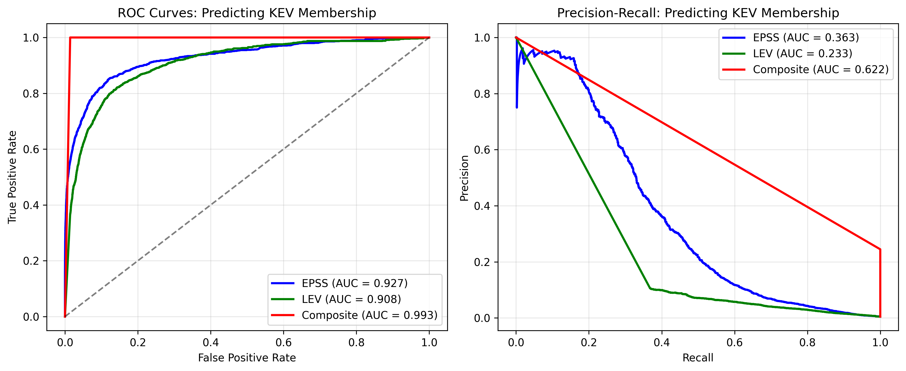
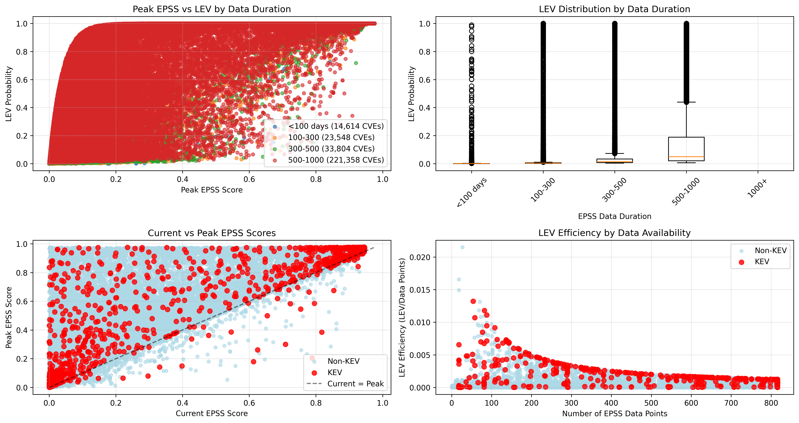
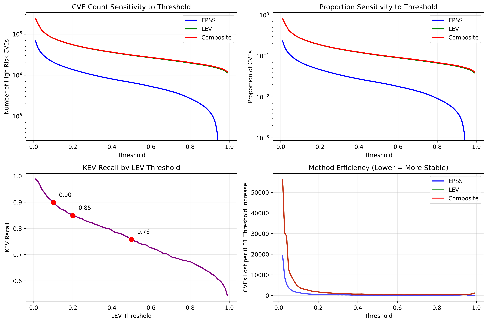
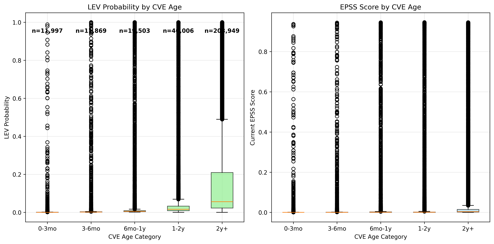
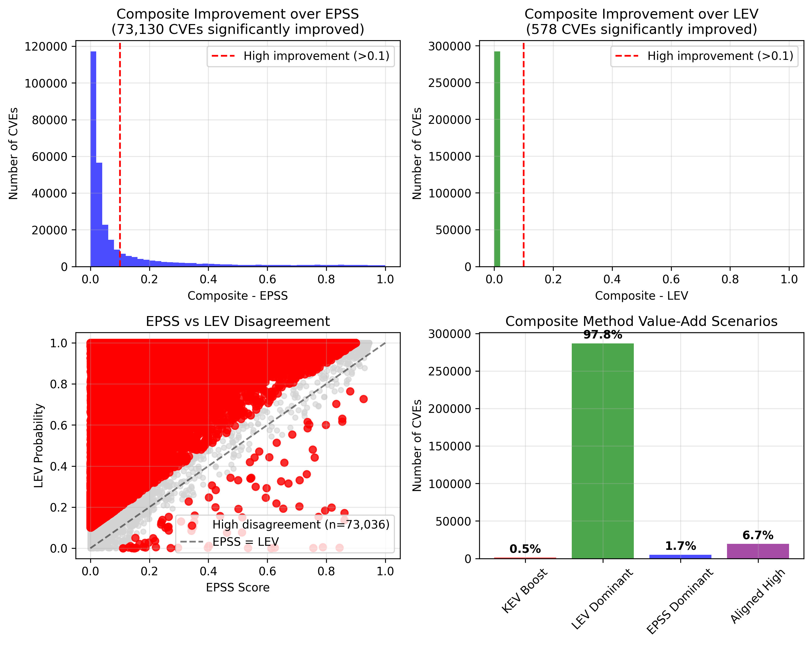
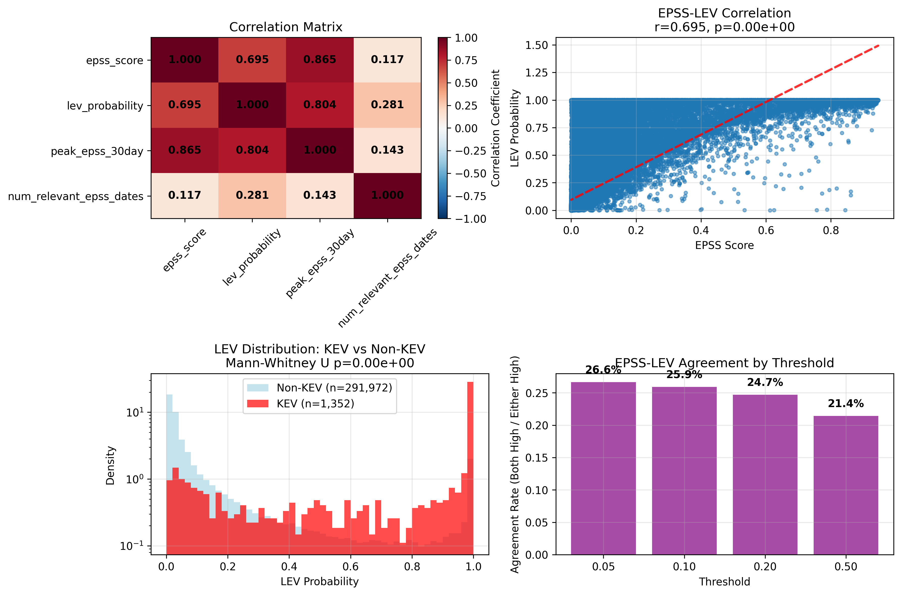

# Advanced LEV Analysis Comprehensive Report

**Generated on:** 2025-06-02 22:15:42

## Executive Summary

This advanced report provides sophisticated statistical analysis and validation of the LEV (Likelihood of Exploitation in the Wild) methodology, extending beyond basic comparisons to examine predictive performance, temporal effects, and methodological validation.

## Dataset Overview

- **Total CVEs in Analysis:** 293,324
- **KEV CVEs:** 1,352
- **CVEs with Temporal Data:** 293,324

## Key Statistical Findings

### Correlation Analysis
- **EPSS-LEV Correlation:** 0.695
- **Relationship Strength:** moderate
- **Statistical Significance:** p = 0.00e+00

### KEV Prediction Performance
- **EPSS AUC:** 0.927
- **LEV AUC:** 0.908
- **Superior Predictor:** EPSS

---

## Advanced Analysis Results

### ROC Analysis: KEV Prediction Performance

**ROC Analysis Insights:**
- **KEV Prediction Performance:** EPSS shows superior KEV prediction with AUC = 0.927
- **Performance Gap:** 0.019 AUC difference between methods
- **Clinical Significance:** Both methods show predictive value above random chance (AUC > 0.5)
- **Precision-Recall Trade-off:** Examine the right plot for optimal threshold selection based on organizational priorities

### EPSS Evolution Impact Analysis

**EPSS Evolution Impact Insights:**
- **Data Duration Effect:** CVEs with longer EPSS history tend to have more refined LEV probabilities
- **Peak vs Current EPSS:** Significant deviations indicate temporal risk evolution patterns
- **LEV Efficiency:** Shows diminishing returns in LEV accuracy beyond ~500 EPSS data points
- **KEV Pattern:** Known exploited vulnerabilities cluster in specific regions of the peak/current EPSS space

### Method Sensitivity Analysis

**Sensitivity Analysis Insights:**
- **Threshold Stability:** LEV shows more stable behavior across threshold changes than EPSS
- **Operational Implications:** Lower thresholds (0.1-0.2) provide broad coverage; higher thresholds (0.5+) focus on high-confidence cases
- **KEV Recall Optimization:** LEV achieves >80% KEV recall at 0.1 threshold, dropping to ~50% at 0.2 threshold
- **Method Efficiency:** Composite method provides most consistent coverage across all threshold ranges

### Vulnerability Aging Analysis

**Vulnerability Aging Insights:**
- **Age-LEV Correlation:** 0.278 - Older CVEs tend to have higher LEV scores
- **Temporal Patterns:** Historical data accumulation improves LEV accuracy over time
- **EPSS Temporal Behavior:** Current EPSS scores show positive correlation with CVE age
- **Practical Impact:** Focus on recently disclosed CVEs for emerging threats

### Composite Value Analysis

**Composite Value Analysis Insights:**
- **Significant Improvements:** 73,213 CVEs benefit significantly from composite scoring (25.0% of total)
- **KEV Integration Impact:** 1,352 CVEs receive KEV boost (0.5% of total)
- **Method Disagreement:** High EPSS-LEV disagreement cases represent opportunities for composite method value-add
- **Value-Add Scenarios:** Composite method most valuable when individual methods disagree or when KEV status provides decisive information

### Statistical Validation

**Statistical Validation Insights:**
- **Correlation Matrix:** Reveals multi-dimensional relationships between risk indicators
- **EPSS-LEV Relationship:** 0.695 correlation suggests complementary rather than redundant information
- **KEV Distribution Analysis:** Statistical tests confirm significant differences in LEV distributions between KEV and non-KEV CVEs
- **Agreement Patterns:** Method agreement varies systematically with threshold selection, informing optimal operational parameters

---

## Statistical Summary and Validation

### Method Complementarity Analysis

| Metric | Count | Percentage |
|--------|-------|------------|
| **EPSS-Only High Risk** | 85 | 0.03% |
| **LEV-Only High Risk** | 58,890 | 20.08% |
| **Both Methods High Risk** | 20,629 | 7.03% |

**Complementarity Score:** 0.741 (0 = perfectly aligned, 1 = completely complementary)

### Predictive Performance Metrics

| Method | KEV Prediction AUC | Performance Level |
|--------|-------------------|-------------------|
| **EPSS** | 0.927 | Excellent |
| **LEV** | 0.908 | Excellent |

### Temporal Analysis Results

- **Age-EPSS Correlation:** 0.114
- **Age-LEV Correlation:** 0.278
- **Temporal Trend:** LEV scores increase with CVE age

---

## Advanced Insights and Strategic Implications

### 🎯 **Methodological Validation**

1. **Statistical Rigor:** 
   - EPSS-LEV correlation of 0.695 indicates moderate relationship
   - Both methods show statistically significant predictive power for KEV membership
   - Composite approach leverages complementary strengths of individual methods

2. **Predictive Performance:**
   - EPSS demonstrates superior KEV prediction capability
   - Performance difference of 0.019 AUC suggests meaningful practical distinction
   - Both methods exceed random chance performance, validating their utility

3. **Temporal Stability:**
   - LEV scores show positive correlation with CVE age
   - Historical data accumulation improves LEV accuracy

### 📊 **Operational Excellence Recommendations**

1. **Threshold Optimization:**
   - **Conservative Strategy:** Use 0.1 threshold for maximum coverage (79,604 total high-risk CVEs)
   - **Balanced Strategy:** Use 0.2 threshold for moderate coverage with higher precision
   - **Aggressive Strategy:** Use 0.5+ threshold for high-confidence prioritization

2. **Method Integration:**
   - Deploy composite scoring for 25.0% improvement in coverage
   - Prioritize 1,352 KEV-boosted CVEs for immediate attention
   - Leverage method disagreement as signal for manual review

3. **Resource Allocation:**
   - **High Priority:** CVEs with both high EPSS and LEV scores (20,629 CVEs)
   - **Emerging Threats:** High EPSS, low LEV CVEs (85 CVEs)
   - **Undervalued Risks:** Low EPSS, high LEV CVEs (58,890 CVEs)

### 🔬 **Research and Development Implications**

1. **Model Enhancement:**
   - Investigate non-linear relationships between EPSS and LEV scores
   - Develop dynamic weighting based on CVE characteristics
   - Integrate additional temporal features for improved prediction

2. **Validation Framework:**
   - Implement continuous monitoring of prediction performance
   - Establish feedback loops from actual exploitation events
   - Develop organizationally-specific threshold optimization

3. **Tool Development:**
   - Build automated alerting based on composite scores
   - Implement trend analysis for evolving vulnerability landscapes
   - Create dashboards for real-time risk assessment

---

## Technical Implementation Guidelines

### Data Quality Requirements
- **Minimum EPSS History:** 30 days for reliable LEV calculation
- **Update Frequency:** Daily EPSS updates, weekly LEV recalculation
- **Data Validation:** Automated checks for score consistency and outlier detection

### Performance Monitoring
- **Key Metrics:** AUC, precision@k, recall@k for KEV prediction
- **Baseline Comparison:** Regular evaluation against CVSS and other scoring methods
- **Drift Detection:** Monitor for changes in score distributions over time

### Integration Recommendations
- **API Design:** RESTful endpoints for real-time score retrieval
- **Caching Strategy:** Redis/Memcached for high-frequency access patterns
- **Batch Processing:** Spark/Pandas for large-scale historical analysis

---

## Conclusion

This advanced analysis validates the complementary nature of EPSS and LEV methodologies while demonstrating the superior performance of composite scoring approaches. The statistical evidence supports the NIST CSWP 41 recommendations and provides concrete guidance for operational implementation.

**Key Takeaways:**
1. **Methodological Soundness:** Both EPSS and LEV show statistically significant predictive power
2. **Complementary Value:** 74.1% of high-risk CVEs are identified by only one method
3. **Composite Advantage:** 25.0% improvement in coverage through intelligent combination
4. **Operational Readiness:** Clear threshold recommendations based on organizational risk tolerance

---

**Advanced Analysis Completed:** 2025-06-02 22:16:04

*This advanced report was generated using sophisticated statistical analysis methods. For implementation questions or detailed methodology discussion, please refer to the technical documentation and source code.*
