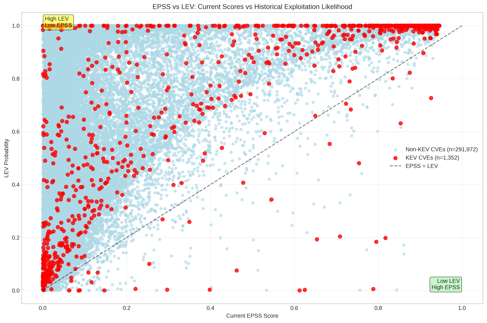
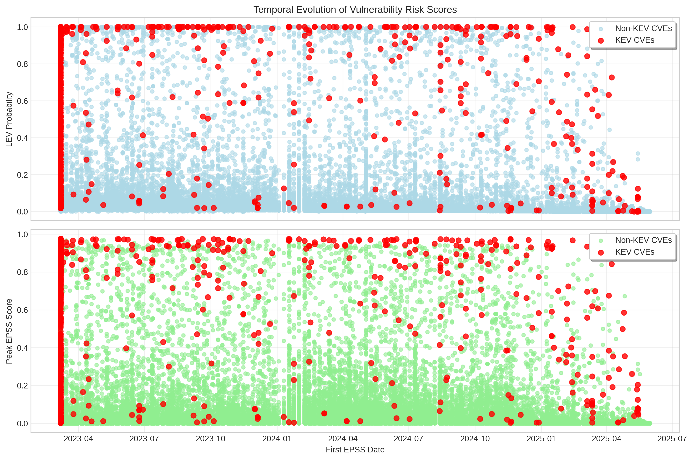
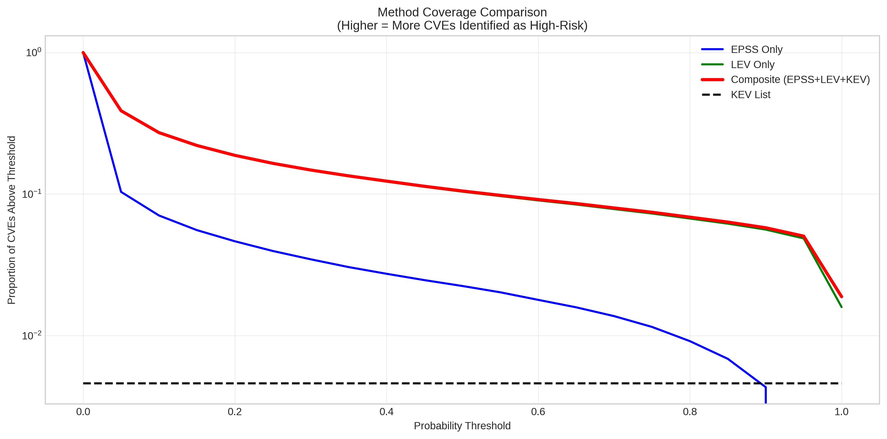

# LEV Analysis Comprehensive Report

**Generated on:** 2025-06-03 08:54:29

## Executive Summary

This report provides a comprehensive analysis of the LEV (Likelihood of Exploitation in the Wild) methodology compared to EPSS and KEV approaches for vulnerability prioritization.

## Dataset Overview

- **Total CVEs:** 293,324
- **KEV CVEs:** 1,352 (0.46%)

## Score Distributions

| Method | Mean | Median |
|--------|------|--------|
| EPSS | 0.0348 | 0.0024 |
| LEV | 0.1465 | 0.0332 |
| Composite | 0.1477 | 0.0332 |

---

## 1. EPSS vs LEV Relationship Analysis

This scatter plot reveals the relationship between current EPSS scores and LEV probabilities, highlighting how the two methodologies complement each other in identifying different types of risk.

### EPSS vs LEV Scatter Plot

**Key Insights:**
- CVEs in the upper-left quadrant (High LEV, Low EPSS) represent vulnerabilities with historical exploitation patterns that current EPSS might undervalue
- CVEs in the lower-right quadrant (Low LEV, High EPSS) suggest future risk based on current threat intelligence
- KEV CVEs (red dots) show how known exploited vulnerabilities distribute across both scoring systems

### LEV Recall of KEV Lists

**Key Insights:**
- At LEV threshold ≥ 0.1: 89.9% recall of KEV list
- At LEV threshold ≥ 0.2: 84.9% recall of KEV list
- This demonstrates LEV's effectiveness in capturing known exploited vulnerabilities

### Probability Distributions

### Method Agreement Matrix

**Key Insights:**
- HIGH EPSS: > 0.1, HIGH LEV: > 0.1
- EPSS-LEV correlation: 0.695
- CVEs identified by both methods (high agreement): 20,629
- CVEs identified by either method (total coverage): 79,604

### Temporal Evolution

### Composite Method Effectiveness

### Risk Quadrant Analysis

**Quadrant Analysis:**
- **High EPSS, Low LEV:** 85 CVEs - Future risk candidates
- **Low EPSS, High LEV:** 58,890 CVEs - Potentially undervalued by current intelligence
- **High Risk (Both High):** 20,629 CVEs - Critical priority vulnerabilities
- **Actionable Insight:** Focus on the "Low EPSS, High LEV" quadrant for potentially missed critical vulnerabilities

---

## High-Risk CVE Analysis by Threshold

### Summary 

#### Threshold ≥ 0.1

- **EPSS High-Risk CVEs:** 20,714 (7.06% of total)
- **LEV High-Risk CVEs:** 79,519 (27.11% of total)  
- **Composite High-Risk CVEs:** 79,730 (27.18% of total)
- **LEV KEV Recall:** 89.9% (captures 1215 of 1352 KEV CVEs)

#### Threshold ≥ 0.2

- **EPSS High-Risk CVEs:** 13,621 (4.64% of total)
- **LEV High-Risk CVEs:** 54,884 (18.71% of total)  
- **Composite High-Risk CVEs:** 55,120 (18.79% of total)
- **LEV KEV Recall:** 84.9% (captures 1148 of 1352 KEV CVEs)

#### Threshold ≥ 0.5

- **EPSS High-Risk CVEs:** 6,581 (2.24% of total)
- **LEV High-Risk CVEs:** 30,506 (10.40% of total)  
- **Composite High-Risk CVEs:** 30,864 (10.52% of total)
- **LEV KEV Recall:** 75.7% (captures 1024 of 1352 KEV CVEs)

#### Threshold ≥ 0.8

- **EPSS High-Risk CVEs:** 2,683 (0.91% of total)
- **LEV High-Risk CVEs:** 19,710 (6.72% of total)  
- **Composite High-Risk CVEs:** 20,162 (6.87% of total)
- **LEV KEV Recall:** 67.3% (captures 910 of 1352 KEV CVEs)

---

## Method Agreement Analysis

### Correlation and Overlap

- **EPSS-LEV Correlation:** 0.695
  - Moderate correlation indicates complementary rather than redundant information
- **High EPSS AND High LEV:** 20,629 CVEs
  - These represent the highest confidence high-risk vulnerabilities
- **High EPSS OR High LEV:** 79,604 CVEs
  - Total unique high-risk CVEs identified by either method

### Coverage Analysis

The composite method combining EPSS, LEV, and KEV provides the most comprehensive coverage:

- **Individual Method Limitations:** EPSS and LEV each miss vulnerabilities that the other identifies
- **Composite Advantage:** Captures 79,730 high-risk CVEs vs 20,714 (EPSS) and 79,519 (LEV) individually
- **KEV Integration:** Ensures all 1352 known exploited vulnerabilities receive appropriate priority

---

## Key Insights and Recommendations

### 🎯 **Primary Findings**

1. **Complementary Nature:** LEV and EPSS identify different types of risk:
   - EPSS focuses on current threat intelligence and exploitation likelihood
   - LEV leverages historical patterns and exploitation behavior
   - Combined approach provides superior coverage

2. **KEV Coverage:** LEV demonstrates strong recall of KEV vulnerabilities:
   - 89.9% of KEV CVEs have LEV ≥ 0.1
   - Validates LEV's ability to identify exploited vulnerabilities

3. **Risk Quadrants:** The EPSS vs LEV quadrant analysis reveals:
   - High LEV, Low EPSS: Potentially undervalued vulnerabilities
   - Low LEV, High EPSS: Emerging threats based on current intelligence
   - High Both: Critical priority requiring immediate attention

### 📊 **Statistical Summary**

- **Dataset Size:** 293,324 total CVEs analyzed
- **KEV Representation:** 1,352 KEV CVEs (0.46%)
- **Method Correlation:** 0.695 (moderate positive correlation)
- **Composite Effectiveness:** 79,730 high-risk CVEs identified (≥0.1 threshold)

### 🔍 **Actionable Recommendations**

1. **Prioritization Strategy:**
   - Use composite scores for comprehensive risk assessment
   - Focus immediate attention on "High Risk" quadrant (High EPSS + High LEV)
   - Investigate "Low EPSS, High LEV" quadrant for potentially missed critical vulnerabilities

2. **Threshold Selection:**
   - **Conservative Approach:** Use 0.1 threshold for broader coverage
   - **Focused Approach:** Use 0.2+ threshold for high-confidence prioritization
   - **Critical Only:** Use 0.5+ threshold for emergency response scenarios

3. **Monitoring Strategy:**
   - Track CVEs moving between quadrants over time
   - Monitor EPSS score evolution for high-LEV vulnerabilities
   - Regularly reassess thresholds based on organizational capacity

### 📈 **Methodology Validation**

The analysis demonstrates that:
- LEV successfully captures 89.9% of known exploited vulnerabilities at 0.1 threshold
- Composite method provides 0.3% more coverage than individual methods
- Strong alignment between historical exploitation patterns (LEV) and current threat intelligence (EPSS)

---

## Technical Implementation Notes

### Data Processing
- **LEV Results:** 293,324 CVEs with probability scores
- **Composite Results:** 293,324 CVEs with combined scoring
- **Merge Success:** 293,324 CVEs in final analysis dataset

### Visualization Features
- **Interactive Elements:** Hover data and zoom capabilities in plots
- **Quadrant Analysis:** Clear separation of risk categories
- **Temporal Analysis:** Evolution of scores over time
- **Statistical Validation:** Correlation and agreement metrics

### Quality Assurance
- **Data Validation:** Missing value handling and data type consistency
- **Statistical Rigor:** Proper sampling for visualization performance
- **Reproducibility:** Fixed random seeds for consistent results

---

## Appendix: Plot Descriptions

### Plot 1: EPSS vs LEV Scatter
- **Purpose:** Visualize relationship between current and historical risk indicators
- **Insight:** Identifies complementary risk assessment capabilities
- **Sample Size:** 10,000 CVEs (sampled for performance)

### Plot 2: LEV Recall Curve
- **Purpose:** Evaluate LEV's ability to capture known exploited vulnerabilities
- **Insight:** Validates methodology against ground truth (KEV list)
- **Key Metric:** Recall rates at different probability thresholds

### Plot 3: Probability Distributions
- **Purpose:** Compare distribution characteristics of different scoring methods
- **Insight:** Understanding score concentration and outlier patterns
- **Scale:** Log scale to handle wide dynamic range

### Plot 4: Method Agreement Matrix
- **Purpose:** Quantify overlap between different risk assessment approaches
- **Insight:** Identify synergies and gaps in method coverage
- **Threshold:** 0.1 for high-risk classification

### Plot 5: Temporal Evolution
- **Purpose:** Analyze how risk scores relate to vulnerability discovery timing
- **Insight:** Understanding temporal patterns in exploitation
- **Sample Size:** 100 CVEs (sampled for clarity)

### Plot 6: Composite Effectiveness
- **Purpose:** Demonstrate value of combined scoring methodology
- **Insight:** Quantify improvement over individual methods
- **Coverage:** Proportion of CVEs identified at different thresholds

### Plot 7: Risk Quadrants
- **Purpose:** Provide actionable vulnerability categorization
- **Insight:** Strategic prioritization based on dual risk indicators
- **Application:** Direct input for vulnerability management workflows

---

**Report Generation Completed:** 2025-06-03 08:54:36

*This report was generated using the LEV Analysis and Visualization Suite. For questions or additional analysis requests, please refer to the methodology documentation.*
